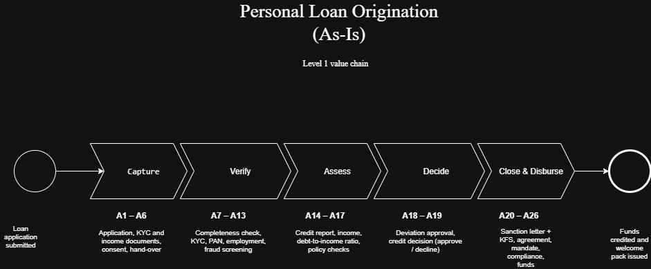
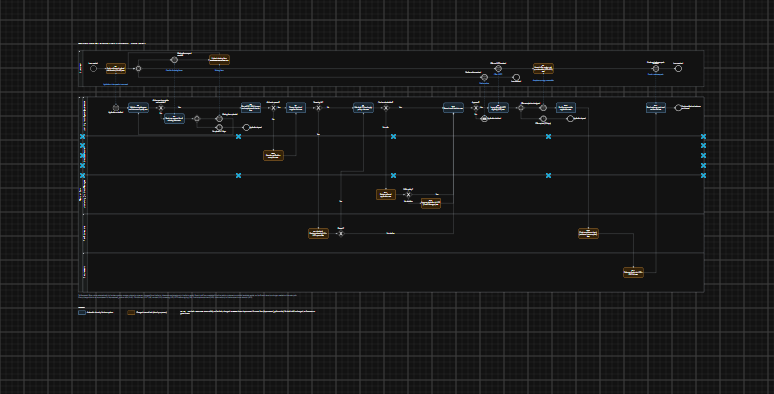

# Personal Loan Origination — As-Is / To-Be Process Analysis

A Business Analysis portfolio project. I mapped how a bank processes a personal loan application today (As-Is), found where it loses time, and designed a faster process (To-Be) without removing any regulatory control.

**The question this project answers:** Why does a personal loan application take days, and what change would make it faster without removing any regulatory control?

> **Note:** Meridian Bank is a fictional bank. Banks do not publish their internal loan processes, so the As-Is process is reconstructed from public sources (RBI regulations, bank product pages, job descriptions and a vendor case study) saved in [`evidence/`](evidence/). Every figure that could not be sourced is an estimate, listed in [`02_assumption_register.xlsx`](analysis/02_assumption_register.xlsx).

---

## Results at a glance

| Metric | As-Is | To-Be (estimate) | Change |
|---|---|---|---|
| Expected turnaround time | 11.5 days | 1.8 days | 85% faster |
| Staff time per application | 5.8 hours | 0.5 hours | −92% |
| Handoffs on the main path | 10 | 6 | −4 |
| Points where data is re-typed | 5 | 0 | −5 |
| Manual staff tasks on the happy path | 22 | 2 | −20 |
| Document-chase rounds per application | 0.5 | 0.1 | −80% |

Source: [`03_process_metrics.xlsx`](analysis/03_process_metrics.xlsx) → Comparison sheet. Both columns are estimates calculated the same way, so the comparison is like for like.

---

## Key findings

1. **Applications spend about 98% of their time waiting.** Someone actually works on a file for about 6 hours out of 11.5 days.
2. **Two stages hold 87% of all waiting:**
   - **Close & Disburse (48%)**: the customer replies to the sanction letter, visits the branch to sign on paper, then waits for the repayment mandate.
   - **Verify (39%)**: about 4 in 10 files are found incomplete only after reaching Credit Operations, so they go back through the branch (the "document chase"), and employers are verified by email.
3. **Root causes** (5 Whys, see [`09_root_cause.md`](documentation/09_root_cause.md)):
   - Document completeness is checked too late, by a team that never meets the customer.
   - Closing is built around paper documents and separate steps.

## Recommendations

1. **Digital application with enforced completeness:** the application cannot be submitted until every mandatory document is uploaded and readable.
2. **Automatic checks at submission:** KYC, PAN, credit bureau, employment and fraud screening run straight away; staff only handle exceptions.
3. **One-step digital closing:** after reading the Key Fact Statement, the customer accepts, e-signs and sets up the e-mandate in one session.

Regulatory controls kept: KYC, customer consent, fraud and AML screening, Key Fact Statement before signing, final compliance check, and disbursal only to the borrower's own account.

---

## Process diagrams

**Level 1: the five stages**

**As-Is: the current process (BPMN 2.0)**

.png>)

**To-Be: the redesigned process (BPMN 2.0)**

Blue boxes are done automatically by the loan system. Orange boxes are manual tasks that changed from the As-Is.

---

## How the project is organised

Files are listed in the order they were built.

### 1. Framing — `documentation/`
| File | What it is |
|---|---|
| [01_process_selection.md](documentation/01_process_selection.md) | Why personal loan origination was chosen |
| [02_process_scope.md](documentation/02_process_scope.md) | Start, end, and what is in and out of scope |
| [03_business_case_context.md](documentation/03_business_case_context.md) | Business context and problem statement |
| [04_stakeholders.md](documentation/04_stakeholders.md) | Stakeholder register |
| [05_elicitation_plan.md](documentation/05_elicitation_plan.md) | Which techniques were performed and which were simulated |
| [06_interview_guides.md](documentation/06_interview_guides.md) | Interview guides for five roles (prepared, not yet conducted) |
| [07_source_log.md](documentation/07_source_log.md) | The nine public sources used |

### 2. As-Is analysis
| File | What it is |
|---|---|
| [08_as_is_narrative.md](documentation/08_as_is_narrative.md) | The current process in words: 26 activities (A1–A26) |
| [models/as-is/](models/as-is/) | Level 1 value chain and As-Is BPMN diagrams (happy path and full model with exceptions) |
| [01_raci_matrix.xlsx](analysis/01_raci_matrix.xlsx) | Who does what, and the problems the RACI reveals |
| [02_assumption_register.xlsx](analysis/02_assumption_register.xlsx) | Every estimate, with its reason and confidence |
| [03_process_metrics.xlsx](analysis/03_process_metrics.xlsx) | Activity times, turnaround, handoffs, bottleneck chart, As-Is vs To-Be comparison |
| [04_pain_point_log.xlsx](analysis/04_pain_point_log.xlsx) | Top 10 problems, ranked by severity |
| [09_root_cause.md](documentation/09_root_cause.md) | 5 Whys on the top two problems |

### 3. To-Be design
| File | What it is |
|---|---|
| [05_improvement_options.xlsx](analysis/05_improvement_options.xlsx) | Improvement ideas generated with ECRS, scored, and chosen |
| [models/to-be/](models/to-be/) | To-Be BPMN diagram (draw.io) |
| [06_gap_analysis.xlsx](analysis/06_gap_analysis.xlsx) | What must change from As-Is to To-Be (17 gaps) |

### 4. Requirements and testing
| File | What it is |
|---|---|
| [10_BRD.docx](documentation/10_BRD.docx) | Business Requirements Document: 9 business, 24 functional, 5 non-functional requirements |
| [07_traceability_matrix.xlsx](analysis/07_traceability_matrix.xlsx) | Pain point → gap → requirement → user story → test |
| [08_uat_test_cases.xlsx](analysis/08_uat_test_cases.xlsx) | 13 test cases, including 8 negative tests |

---

## How this was built

- **Sources:** RBI KYC Directions 2025, RBI Digital Lending Directions 2025, ICICI, SBI and Kotak personal loan pages, two job descriptions, and one vendor case study.
- **Tools:** draw.io (BPMN 2.0), Microsoft Excel / Google Sheets, Microsoft Word, VS Code.
- **Method:** process narrative → BPMN model → time measurement → pain points → 5 Whys → ECRS options → To-Be model → gap analysis → requirements → traceability → test cases.

## Limitations

- No real bank data. All times are estimates, recorded in the assumption register with a confidence level.
- The As-Is was not validated with bank staff. The interview guides are prepared but were not conducted.
- The conclusions rely on which stages wait longest, not on exact numbers.

**With real access**, I would validate the As-Is with operations staff and replace the estimates with status timestamps from the bank's loan system.

---

**Author:** Varun
